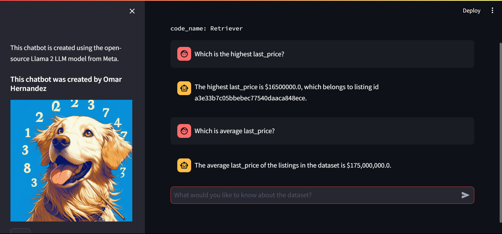

# Retriever


## Overview

Retriever is a chatbot powered by llamav2, designed to retrieve information from a CSV file containing listings data.
This project was initially developed as part of a work application challenge to
showcase skills in building backend-frontend applications.

## Project Structure

- **app**: Contains the backend and frontend components of the chatbot.
- **notebooks**: Contains exploratory data analysis (EDA) notebooks used during the development process.

## Running the Chatbot

### Prerequisites:
You need to install docker. You can follow instructions from [this link](https://docs.docker.com/engine/install/).

### Instructions
To run the chatbot, follow these steps:

1. Clone this repository to your local machine.
2. Download the ``llama-2-7b-chat.ggmlv3.q8_0`` model from [this repo](https://huggingface.co/TheBloke/Llama-2-7B-Chat-GGUF/tree/main)
3. Locate the model into the ``./app/backend/models`` folder.
2. Navigate to the app directory of the project by running the command:
   ```
    cd app
    ```
3. Run the following command in your terminal:

   ```
   docker compose up -d --build
   ```

This command will launch two Docker containers: one for the frontend and one for the backend.

## Frontend and Backend Components

- **Frontend**: The frontend of the chatbot is built using Streamlit and is accessible via port `8501`.
- **Backend**: The backend handles data retrieval and processing.
  It communicates with the frontend to provide responses to user queries.

## Usage

Once the chatbot is running, access it through your web browser by visiting `http://localhost:8501`.
Here are some examples of ``retriever`` running.


## Improvements

- Implement user input validation to prevent injection attacks.
- Optimize performance by converting embeddings and models to llama.ccp framework.
- Generate metrics for API usage to track performance and identify areas for improvement.
- Scale up the app by implementing FastAPI routers in the API architecture.

## Contributing

Contributions to this project are welcome! If you'd like to contribute, please submit bug reports, 
feature requests, or pull requests through GitHub or to ``omarafjo@gmail.com``

## Contact

For questions or support, please contact ``omarafjo@gmail.com``.

## License

This project is licensed under the MIT LICENCE. See the LICENSE file for more details.

---


